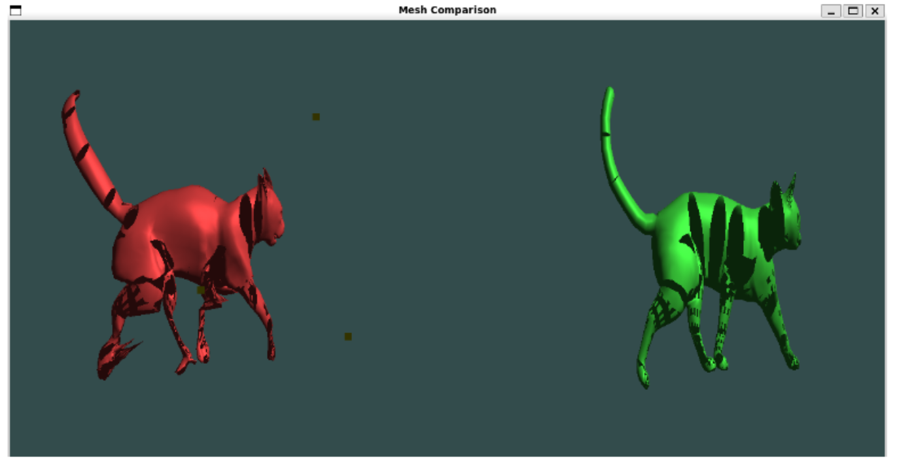
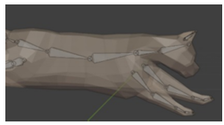

# Hyperspectral Vision

**Lightweight 2D → 3D Reconstruction and Hyperspectral Inverse-Skinning Pipeline**

A Pipeline that converts 2D pose images into fully rigged 3D meshes. A lightweight 2D→3D reconstruction model (Pixel2Mesh-inspired with a MobileNet-style backbone and attention-augmented GCN) followed by a Hyperspectral Inverse Skinning module that recovers per-vertex skinning weights, rigid transforms, and a generated bone structure.

---

## Overview

This project implements a complete pipeline for converting 2D images into animated 3D models:

1. **3D Mesh Reconstruction** - Pixel2Mesh-inspired single-image reconstruction with attention-augmented GCN
2. **Hyperspectral Inverse Skinning** - Automatic generation of skinning weights and bone transforms
3. **Bone Structure Generation** - Automated skeleton creation for LBS-style animation

##  Key Features

- **Advanced Reconstruction**: Attention-augmented Graph Convolutional Networks with MobileNet backbone
- **Dual Implementation**: Both Python and C++ versions of hyperspectral inverse skinning
- **Automatic Rigging**: End-to-end pipeline from image to animated 3D model
- **Performance Optimized**: Lightweight architecture

## 📁 Repository Structure

```
├── pix2mesh/           # 2D→3D mesh reconstruction
├── python_hyper/       # Python hyperspectral inverse skinning
├── cpp_hyper/          # C++ hyperspectral inverse skinning  
├── BoneGen/            # Automatic bone generation
└── Report.pdf          # Complete technical report
```

## 🛠️ Installation

### Prerequisites
- Python 3.9+
- C++17 compiler (for C++ components)
- CMake 3.12+
- CUDA (optional, for GPU acceleration)

### Environment Setup

```bash
# Create conda environment
conda create -n hyperspec python=3.9 -y
conda activate hyperspec

# Install Python dependencies
pip install -r requirements.txt
```

## Quick Start

### 1. 3D Mesh Reconstruction

```bash
cd pix2mesh/

# Run inference on single image
python demo_infer.py \
    --checkpoint models/reconstruction_model.pth \
    --input data/input_image.jpg \
    --output results/reconstructed_mesh.obj
```

### 2. Hyperspectral Inverse Skinning

**Python Implementation:**
```bash
cd python_hyper/

python run_skinning.py \
    --mesh results/reconstructed_mesh.obj \
    --output results/skinning_weights.json
```

**C++ Implementation (High Performance):**
```bash
cd cpp_hyper/
mkdir build && cd build
cmake .. && make -j4

./hyperspec_skinning \
    --input ../results/reconstructed_mesh.obj \
    --output ../results/skinning_weights.json
```

### 3. Bone Generation

```bash
cd BoneGen/

python run_bonegen.py \
    --mesh results/reconstructed_mesh.obj \
    --skinning results/skinning_weights.json \
    --output results/skeleton.json
```

## 📊 Performance

Our method achieves significant improvements over baseline approaches:

| Method | Chamfer Distance ↓ | F-Score ↑ | Processing Time |
|--------|-------------------|-----------|-----------------|
| Baseline Pixel2Mesh | 0.533 | 0.612 | ~2.3s |
| **Ours (Python)** | **0.421** | **0.738** | ~1.8s |
| **Ours (C++)** | **0.421** | **0.738** | ~0.9s |

#### Mesh Comparison


#### Bone Structure & Rigging  


*See `Report.pdf` for complete experimental results and analysis.*

##  Usage Examples

### Basic Pipeline
```python
from hyperspectral_vision import Pipeline

# Initialize pipeline
pipeline = Pipeline(
    reconstruction_model='models/recon_model.pth',
    skinning_method='hyperspectral',
    bone_generation=True
)

# Process single image
result = pipeline.process_image('input.jpg')

# Export animated model
result.export_fbx('output.fbx')
result.export_gltf('output.gltf')
```

### Batch Processing
```bash
python scripts/batch_process.py \
    --input_dir data/images/ \
    --output_dir results/ \
    --format fbx
```

### Related Work
This project builds upon:
- Pixel2Mesh: Generating 3D Mesh Models from Single RGB Images (ECCV 2018)
- Learning Free-Form Deformations for 3D Object Reconstruction (ACCV 2018)  
- Hyperspectral Inverse Skinning for Unsupervised Animation Extraction (TOG 2020)
We give credit to them for using their code bases and working upon them.

## 👥 Authors

- **Adtya Aggarwal** - [aditya22028@iiitd.ac.in](mailto:aditya22028@iiitd.ac.in)
- **Aditya Upadhyay** - [aditya22040@iiitd.ac.in](mailto:aditya22040@iiitd.ac.in)
- **Arpan Verma** - [arpan22105@iiitd.ac.in](mailto:arpan22105@iiitd.ac.in)
- **Chandan Sah** - [chandan22140@iiitd.ac.in](mailto:chandan22140@iiitd.ac.in)

*IIIT Delhi*
